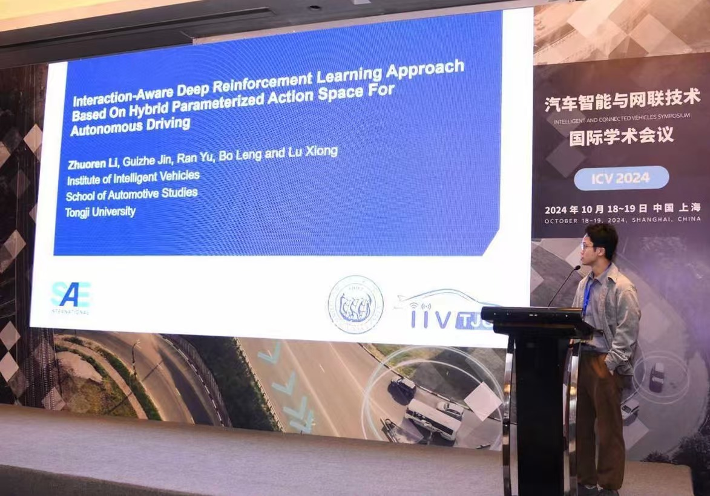

 

Congratulate myself for the SAE International Outstanding Technical Paper Award in the 2024 INTELLIGENT AND CONNECTED VEHICLES SYMPOSIUM.

It is pleasure to share our recent work about reinforcement learning motion planning for autonomous driving.

Our paper titled "Interaction-aware Deep Reinforcement Learning Approach based on Hybrid Parameterized Action Space for Autonomous Driving", which was completed by me and two master's students in a month's time!!

Although it is not a very top-level academic conference, it's nice to get this small achievement and keep moving forward to contribute to the community in my own small way!

<!-- {}
Click on the **Slides** button above to view the built-in slides feature.
{} -->

<!-- Slides can be added in a few ways:

- **Create** slides using Hugo Blox Builder's [_Slides_](https://docs.hugoblox.com/reference/content-types/) feature and link using `slides` parameter in the front matter of the talk file
- **Upload** an existing slide deck to `static/` and link using `url_slides` parameter in the front matter of the talk file
- **Embed** your slides (e.g. Google Slides) or presentation video on this page using [shortcodes](https://docs.hugoblox.com/reference/markdown/).

Further event details, including [page elements](https://docs.hugoblox.com/reference/markdown/) such as image galleries, can be added to the body of this page. -->
