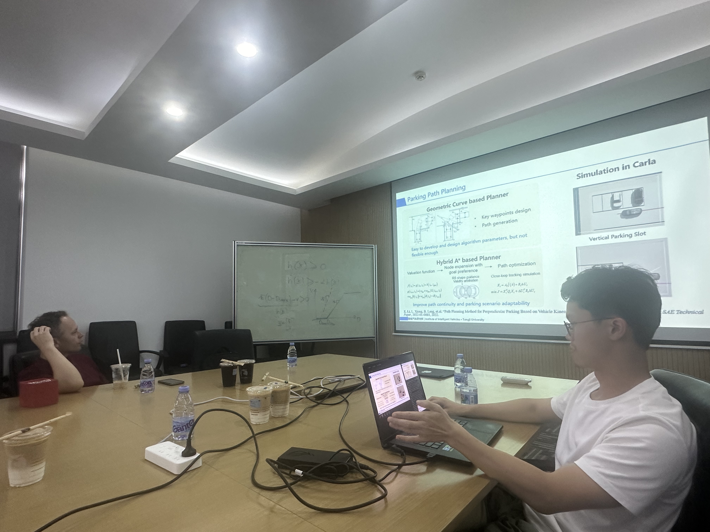

 

It was pleasured to invite Prof. Gabor Orosz from the University of Michigan to the Intelligent Vehicle Research Institute of Tongji University, Shanghai, China. 

Prof. Gabor shared his academic presentation "Improving the efficiency of road transportation using connectivity and automation" and I also shared with him some of my research work and practical projects during my PhD period. 

It was a very enjoyable communication and Prof. Gabor Orosz is a very nice person who is happy to share his viewpoints with us. I was grateful for the opportunity to learn about his academic research face to face.

