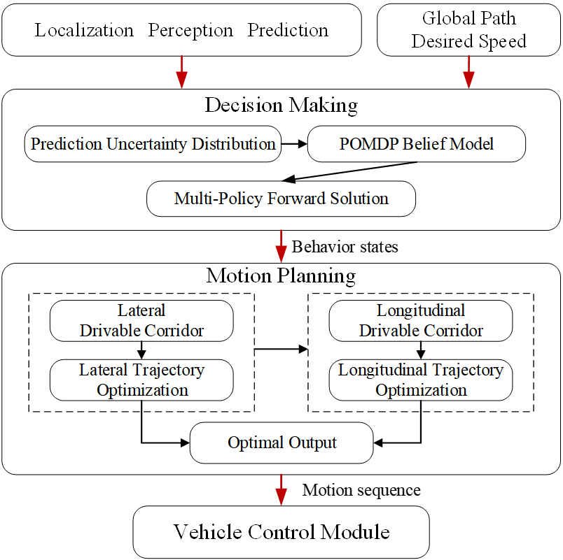
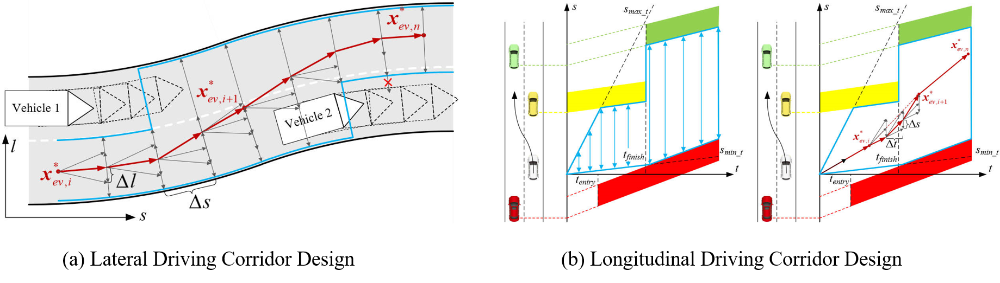

<!-- code mode
```python
from IPython.core.display import Image
Image('https://www.python.org/static/community_logos/python-logo-master-v3-TM-flattened.png')
``` -->
Smooth, stable and fast motion planning based on optimization-based approaches.

# Integrated Decision-making and Motion Planning to Enhance Oscilation-free Capability 
    
 
## **Motivation**
**Unstable and Unsmooth motion in Uncertainty Environment**
- Since there is a high-dimensional state/action modeling and the solution process considers the motion evolution of others, both POMDP and game-theory are easy to fall into the dimensionality problem, which makes the algorithm difficult to solve.
- Most existing studies consider decision making and planning/control separately, simple decision results may not be effectively utilized by planning, which tends to make the solution process of motion planning time-consuming, or the planning unable to reach decision expectations, trajectory shaking and even solving failure in dealing with complex scenarios

## **Highlights**
- Able to make oscillation-free behavior decisions given biased prediction.
- Able to cut through in the traffic efficiently and safely when being in squeezed. 
- Able to accelerate computation efficiency by building a state transfer model based on prediction uncertainty
- ble to reduce the dissonance between decision-making and motion planning.

   


# A Unified Trajectory Planning and Tracking Control Framework for Autonomous Overtaking Based on Hierarchical MPC 

## **Highlights**
- A unified trajectory planning and tracking control framework for autonomous overtaking using hierarchical MPC.
- Safety corridor generation on ST-Graph with different behavior mode.


## **Published paper:**
1. Zhuoren Li, Jia Hu, Bo Leng, et.al., "An Integrated of Decision Making and Motion Planning Framework for Enhanced Oscillation-Free Capability," IEEE Trans. Intell. Transp. Syst., early access, 2023.
2. Zhuoren Li, Lu Xiong Bo Leng, "A Unified Trajectory Planning and Tracking Control Framework for Autonomous Overtaking Based on Hierarchical MPC," in Proc. IEEE Int. Intell. Transp. Syst., 2022, pp. 937-944.

## **Paper in Preparation:**
1. Zhuoren Li, Jia Hu, Bo Leng, Lu Xiong, et.al., "Safety Enhanced Reinforcement Learning for Autonomous Driving: Dare to Make Mistakes to Learn Faster and Better.“” (Preparing to submit IEEE Trans. Transp. Electrif.)
2. Ruolin Yang, Zhuoren Li, Bo Leng, et.al.，"Convergent Harmonious Decision: Lane Changing in a more Traffic Friendly Way." (under review of IEEE Trans. Intell. Vehicles)
3. Bo Leng, Ran Yu, Zhuoren Li*, Wei Han and Lu Xiong, "Interaction-Aware Safe Reinforcement Learning for Driving through Intersection" 