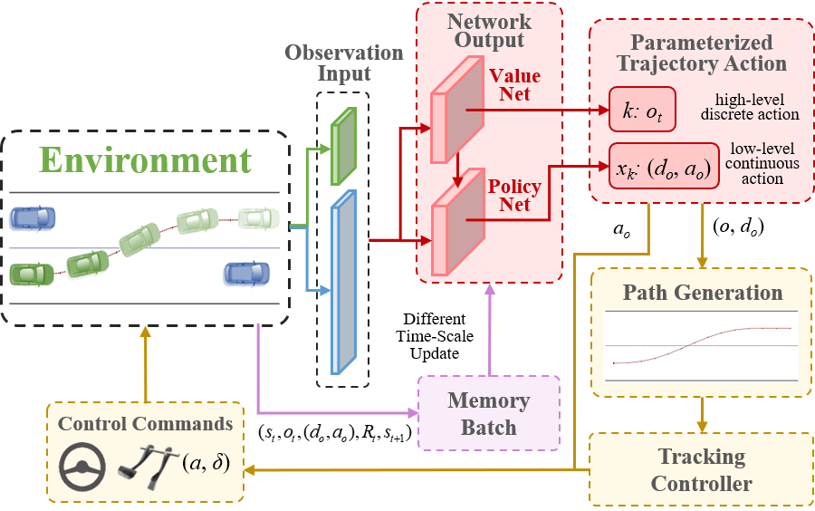
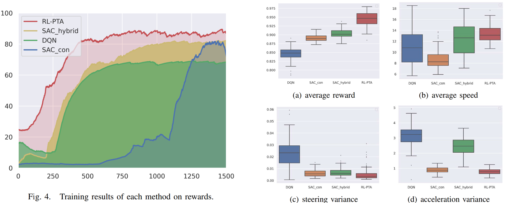

## Stability Enhanced DRL with Parameterized Trajectory Action
Collaborating student: *Guizhe Jin, 1st-year Gruaduated Student*.

### **Motivation**
When DRL directly control the vehicle's motion:
- The output commands are easy to change continuously whent DRL agent directly generates the control command.
- The control commands generated in real-time are prone to sudden changes in dynamically changing environments due to the lack of long-term motion planning.

Simultaneously considering the longterm discrete lane-change behavior goal and short-term realtime vehicle control. A hierarchical Reinforcement Learning method with a hybrid action space is designed to enhance driving stability and smoothness based on parameterized trajectory actions.

### **Highlights**
- Proposes a stability enhanced hierarchical reinforcement learning framework to achieve smooth and flexible driving behavior in dynamic traffic environment.
- Enables RL agent to participate in trajectory generation, where the trajectory parameter action is used to generate future motion path that adapt to various scenes.
- Realizes hybrid action output based on parameterized action space, hence the discrete and continuous actions have the optimal consistency.

### **Some Reults**

<!-- ## **Published paper:**
1. Zhuoren Li, Lu Xiong, Bo Leng et.al. Safe Reinforcement Learning of Lane Change Decision Making with Risk-Fused Constraint, in Proc. IEEE Int. Conf. Intell. Transp. Syst. (ITSC), 2023, pp. 1313-1319. -->

## **Paper in Preparation:**
1. Guizhe Jin, Zhuoren Li, Bo Leng, Wie Han and Lu Xiong, "Stability Enhanced Hierarchical Reinforcement Learning for Autonomous Driving with Parameterized Trajectory Action." (under review in IEEE Int. Conf. Intell. Transp. Syst. (ITSC), 2024.
