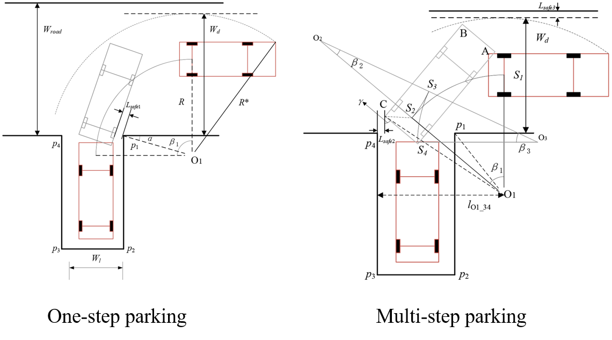
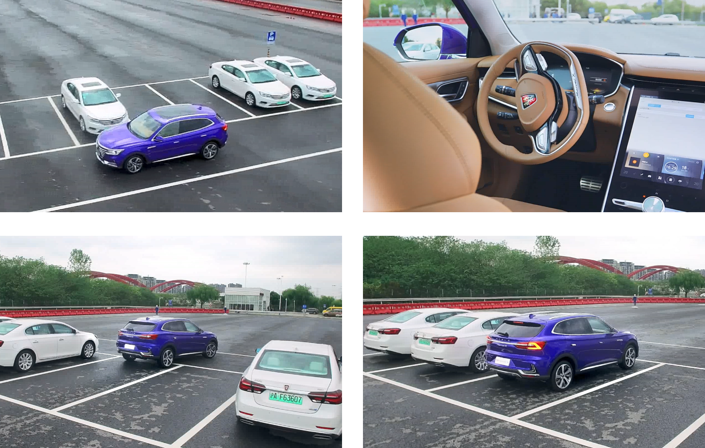
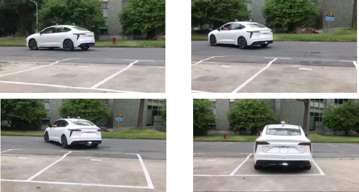
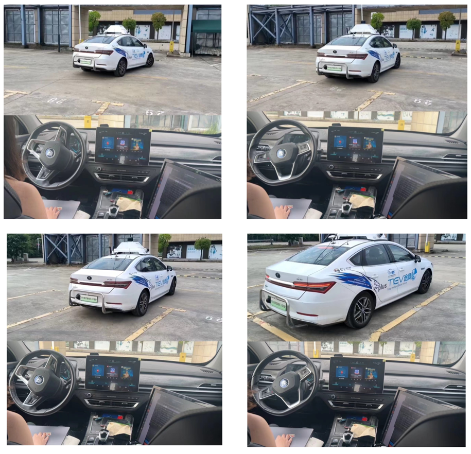

## **Parking Path Planning in AVP System**
<!-- Collaborating student: *Guizhe Jin, 1st-year Gruaduated Student*. -->

<!-- ### **Motivation**
When DRL directly control the vehicle's motion:
- The output commands are easy to change continuously whent DRL agent directly generates the control command.
- The control commands generated in real-time are prone to sudden changes in dynamically changing environments due to the lack of long-term motion planning. -->

The whole system is consisted of outdoor/indoor localization, parking slot perception, path planning and trakcing control.The overall framework is as following：

Firstly, the minimum road width required for one-step parking is calculated by considering the geometric relationship between the initial position of the vehicle and the parking slot. Secondly, the parking path is determined based on the collision constraints of the parking slot. Finally, we establish the vehicle kinematics error model and use the MPC algorithm to optimize the parking path.

### **This research havs supported many engineering projects**

AVP system for SAIC Motor Corporation, Ltd. (mass-produced electric vehicle: Marvel X)

AVP system for New Energy Vehicle Corporation, Jiangxi Jiangling Motors Group.

Autonomous Parking of Tiev-Plus vehicl for China Future Challenge of Intelligent Vehicles 

## **Published Paper:**
1. Zhuoren Li, Lu Xiong, Bo Leng, et.al. Path Planning Method for Perpendicular Parking Based on Vehicle Kinematics Model Using MPC Optimization. SAE Technical Papers, 2022-01-0085, 2022. 
