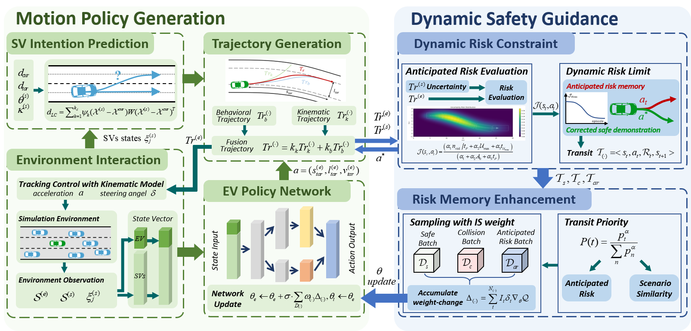
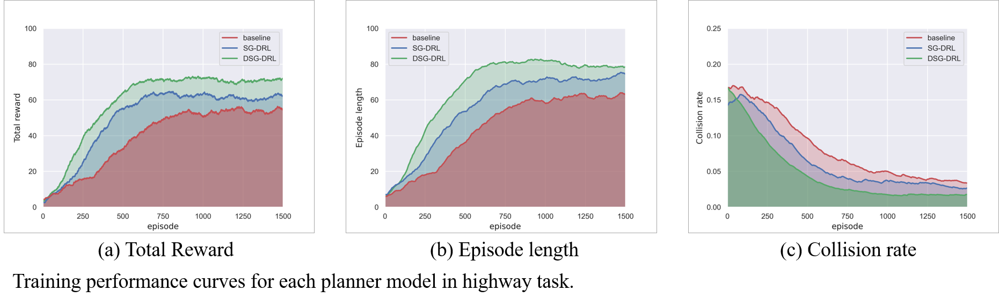
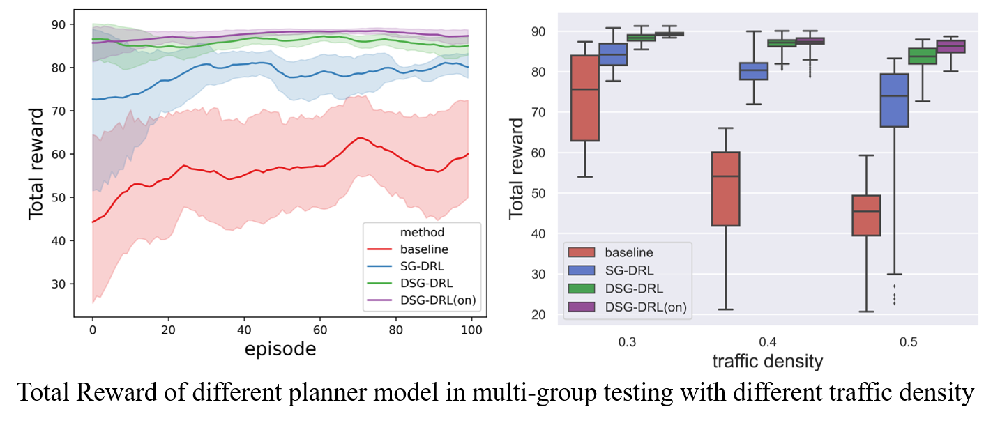

## **Safe DRL with risk evaluation and dangerous momry enhancement**
Collaborating student: *Ruolin Yang, 3rd-year Gruaduated Student*; *Ran Yu, Undergraduate Student*.

### **Motivation**
Deep reinforcement learning (DRL) has become a powerful method for autonomous driving while often lacking safety guarantees.

 

Proposeing a safety enhanced deep reinforcement learning for autonomous motion planning in lane-changing maneuver. The goal of this work is to design a DRL motion planner, which dares to make mistakes to learn the safe driving policy faster and better.

### **Highlights**
- Evaluate the future motion risk by projecting DRL behavior action into the feasible trajectory, while sorrunding vehicles' trajecotires are obtained from the prediction module.
- Dangerous action will be prevented and the dangerous virtual experiences are recoreded to gain various valuable experience data.
- Dangerous experiences are sampled with priority weight according their anticipated risk, enabling DRL agnet to learn a safer policy.

### **Some Results**
 
 

Proposed safety enhanced DRL approach could improve the driving performance, espeacially in safety metrics such as reducing collision rate, anticipated risk, etc.
More details can be found in our recent paper "Safety Enhanced Reinforcement Learning for Autonomous Driving: Dare to Make Mistakes to Learn Faster and Better." (in preparation, it will come soon)

## Current Work
- Combination hard-constraints and soft-constraints in safe policy training.
- A learnable evaluation module to predict the anticipated risk.
- Considering interaction features in critic network design based on Game-Theory.
- Application of self-attention mechanisms in policy network design

## **Published paper:**
1. Zhuoren Li, Lu Xiong, Bo Leng et.al., "Safe Reinforcement Learning of Lane Change Decision Making with Risk-Fused Constraint," in Proc. IEEE Int. Conf. Intell. Transp. Syst. (ITSC), 2023, pp. 1313-1319.
2. R. Yang, Z. Li, B. Leng and L. Xiong, "Safe reinforcement learning for autonomous vehicles to make lane-change decisions: Constraint based on Incomplete Information Game Theory," Int. Conf. Veh. Control and Intelligence (CVCI), 2023.
## **Paper in Preparation:**
1. Zhuoren Li, Jia Hu, Bo Leng, Lu Xiong, et.al., "Safety Enhanced Reinforcement Learning for Autonomous Driving: Dare to Make Mistakes to Learn Faster and Better." (Preparing to submit IEEE Trans. Transp. Electrif.)
2. Ruolin Yang, Zhuoren Li, Bo Leng, et.al.，"Convergent Harmonious Decision: Lane Changing in a more Traffic Friendly Way." (under review of IEEE Trans. Intell. Vehicles)
3. Bo Leng, Ran Yu, Zhuoren Li*, Wei Han and Lu Xiong, "Interaction-Aware Safe Reinforcement Learning for Driving through Intersection" 